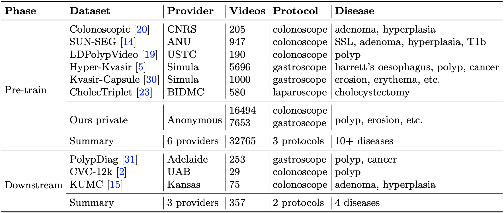

## Datasets

#### Pre-training
- [Colonoscopic](http://www.depeca.uah.es/colonoscopy_dataset/)
- [SUN-SEG](https://github.com/GewelsJI/VPS/blob/main/docs/DATA_PREPARATION.md)
- [LPPolypVideo](https://github.com/dashishi/LDPolypVideo-Benchmark)
- [Hyper-Kvasir](https://datasets.simula.no/hyper-kvasir/)
- [Kvasir-Capsule](https://datasets.simula.no/kvasir-capsule/)
- [CholecTriplet](https://cholectriplet2021.grand-challenge.org/)
- [Private]()

#### Downstream
- [PolypDiag](https://github.com/tianyu0207/weakly-polyp)
- [CVC-12k](https://polyp.grand-challenge.org/Databases/)
- [KUMC](https://dataverse.harvard.edu/dataset.xhtml?persistentId=doi:10.7910/DVN/FCBUOR)

Once downloaded, the data should be put under `data/pretrain`. And generate the video list referring to `../preprocess/gentxt.py`.

Then you can easily process them as 5s short video clips with 30FPS for further usage referring to `../preprocess/trans_videos_pretrain.py` and `../preprocess/kumc.py`. 
