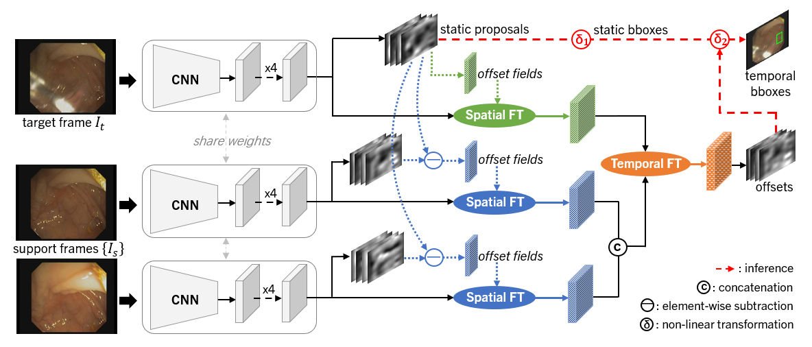

# STFT: Spatial-Temporal Feature Transformation

[](LICENSE)

By [Lingyun Wu](https://scholar.google.com/citations?user=WmAYPtkAAAAJ&hl=en), [Zhiqiang Hu](https://scholar.google.com/citations?hl=en&user=n8E_lV8AAAAJ), [Yuanfeng Ji](https://scholar.google.com/citations?hl=en&user=7HGv1bkAAAAJ), [Ping Luo](http://luoping.me/), [Shaoting Zhang](https://scholar.google.com/citations?hl=en&user=oiBMWK4AAAAJ).

This repo is an PyTorch implementation of ["Multi-frame Collaboration for Effective Endoscopic Video Polyp Detection via Spatial-Temporal Feature Transformation"](https://arxiv.org/abs/2107.03609), accepted by MICCAI 2021. 




This repository contains the implementation of our approach STFT and several other video object detection algorithms like [FGFA](http://openaccess.thecvf.com/content_iccv_2017/html/Zhu_Flow-Guided_Feature_Aggregation_ICCV_2017_paper.html), [RDN](https://openaccess.thecvf.com/content_ICCV_2019/papers/Deng_Relation_Distillation_Networks_for_Video_Object_Detection_ICCV_2019_paper.pdf), and [MEGA](https://openaccess.thecvf.com/content_CVPR_2020/papers/Chen_Memory_Enhanced_Global-Local_Aggregation_for_Video_Object_Detection_CVPR_2020_paper.pdf) based on [mega.pytorch](https://github.com/Scalsol/mega.pytorch), as well as training and testing scripts to reproduce the results on Endoscopic Video Datasets reported in our paper. 


## News


- [2021/11/12] For the implementation on the ImageNet VID dataset, please refer to [here](https://github.com/lingyunwu14/STFT/issues/1#issuecomment-966942437).
- [2021/09/21] Implementation for other video-based methods on Endoscopic Video Datasets released.
- [2021/09/21] Release training/testing scripts and the pretrained model for STFT.
- [2021/06/29] Create repository.


## Model Zoo

Supported backbones:

- [x] [ResNet](https://openaccess.thecvf.com/content_cvpr_2016/papers/He_Deep_Residual_Learning_CVPR_2016_paper.pdf)

Supported image-based methods:

- [x] [FCOS](https://openaccess.thecvf.com/content_ICCV_2019/papers/Tian_FCOS_Fully_Convolutional_One-Stage_Object_Detection_ICCV_2019_paper.pdf) (ICCV2019)
- [x] [RetinaNet](https://openaccess.thecvf.com/content_ICCV_2017/papers/Lin_Focal_Loss_for_ICCV_2017_paper.pdf) (ICCV2017)
- [x] [BorderDet](https://arxiv.org/pdf/2007.11056.pdf) (ECCV2020)

Supported video-based methods:

- [x] [FGFA](http://openaccess.thecvf.com/content_iccv_2017/html/Zhu_Flow-Guided_Feature_Aggregation_ICCV_2017_paper.html) (ICCV2017)
- [x] [RDN](https://openaccess.thecvf.com/content_ICCV_2019/papers/Deng_Relation_Distillation_Networks_for_Video_Object_Detection_ICCV_2019_paper.pdf) (ICCV2019)
- [x] [MEGA](https://openaccess.thecvf.com/content_CVPR_2020/papers/Chen_Memory_Enhanced_Global-Local_Aggregation_for_Video_Object_Detection_CVPR_2020_paper.pdf) (CVPR2020)
- [x] **[STFT](https://arxiv.org/abs/2107.03609)** (MICCAI2021)


## Installation

Please follow [INSTALL.md](INSTALL.md) for installation instructions.


## Usage

Please follow [GetStarted.md](GetStarted.md) for usage instructions.


## Citing STFT
Any new methods are welcomed. We also hope this repository would help further research in the field of video object detection and beyond. Please cite our paper in your publications if it helps your research:
```
@inproceedings{wu2021multi,
  title={Multi-frame collaboration for effective endoscopic video polyp detection via spatial-temporal feature transformation},
  author={Wu, Lingyun and Hu, Zhiqiang and Ji, Yuanfeng and Luo, Ping and Zhang, Shaoting},
  booktitle={International Conference on Medical Image Computing and Computer-Assisted Intervention},
  pages={302--312},
  year={2021},
  organization={Springer}
}
```


## Contributing to the project

Any pull requests or issues are welcomed.
